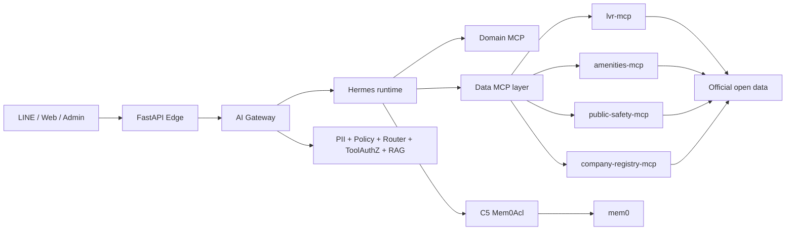

# AI Housekeeper Agent

[](https://github.com/trionnemesis/AIhouskeeperagent/actions/workflows/ci.yml)
[](https://www.python.org/)
[](https://nodejs.org/)
[](./TEST-REPORT.md)

> **AI Housekeeper Agent** is a governed real-estate AI second brain: structured customer memory, property workflows, Taiwan data MCPs, LINE as an interaction surface, and a policy boundary that keeps provenance, tenant scope, and human review visible.

This repository is the engineering foundation for a real-estate operations platform built with **Hermes-Agent**, a planned **mem0** memory boundary, Python/Node MCP services, and VM/GKE deployment paths. It is intentionally spec-driven: the repository records what should be built, what is already executable, what has been verified, and which business or production gates remain open.

The project thesis is not “put an LLM on top of property data.” The durable value is structured customer memory, matching, and workflow embedding. Market data is useful input, but delayed or malformed data must be refused rather than turned into confident-looking advice.

[繁體中文說明](./README.zh-TW.md) · [Test and deployment report](./TEST-REPORT.md) · [Spec Kit](./spec-kit/README.md) · [CI](https://github.com/trionnemesis/AIhouskeeperagent/actions)

## Contents

- [Why](#why)
- [Non-negotiables](#non-negotiables)
- [How it works](#how-it-works)
- [What exists](#what-exists)
- [Trust and governance](#trust-and-governance)
- [Install and verify](#install-and-verify)
- [Local MCP workflow](#local-mcp-workflow)
- [Deployment paths](#deployment-paths)
- [Current status](#current-status)
- [Repository map](#repository-map)
- [Research and specification](#research-and-specification)
- [FAQ](#faq)

## Why

A real-estate agent needs more than a chat interface:

- a property briefing should be consistent and traceable;
- a customer preference should be structured before it becomes memory;
- a match should explain its evidence and uncertainty;
- market, transport, safety, and company data should carry source and as-of metadata;
- a workflow should preserve tenant scope, consent, audit, and human review.

AI Housekeeper Agent is designed as the governed layer connecting those activities. Hermes remains the runtime foundation; MCP servers provide bounded domain and data capabilities; the Gateway is the authority for policy, PII egress, routing, tool authorization, and RAG behavior.

Commercial Gate A — whether at least five real-estate professionals will prepay — is not validated by this repository. This is a technical foundation and verification record, not a product-market-fit claim.

## Non-negotiables

These constraints apply across the repository:

1. **Tenant isolation and PII are P0 release blockers.** Every tenant-owned query must enforce WHERE tenant_id = ?. A session_key routes a conversation; it is not a data boundary. Customer memory must enter through the governed C5/Mem0Acl path, never through a direct shortcut.
2. **Stale or malformed market data must fail closed.** Taiwan transaction data can lag by months and may contain invalid dates. TimestampGuard, freshness metadata, and refusal are safer than an invented current price.
3. **The Gateway is the policy authority.** PII masking, router rules, ToolAuthZ, RAG disclosure, and the 591/leju denylist cannot depend on one assistant or one MCP server remembering a prompt rule.
4. **Public-safety output stays coarse and neutral.** No address-level crime inference, no “safe/unsafe district” labels, and no negative label attached to a single property.
5. **Every external-data answer carries provenance.** Include source identity, data cutoff/as-of date, confidence, and the reason an answer was refused or downgraded.

## How it works

The intended topology keeps runtime, data acquisition, and governance boundaries distinct:



The implementation is deliberately layered:

- **Hermes-Agent** remains the pinned runtime base; integration adapters must not rewrite the core runtime.
- **AI Gateway** is the non-bypassable policy and egress boundary.
- **Data MCPs** are split by source and failure domain, not by arbitrary feature labels.
- **mem0** is a governed customer-memory sink, not a direct dependency of data MCPs.
- **LINE** is an interaction surface, not a substitute for tenant identity or authorization.

## What exists

| Layer | Current implementation |
| --- | --- |
| packages/govnet | TLS verification and bounded retry helpers for official-data fetchers. |
| packages/datastore | SQLite/Postgres persistence, idempotent writes, provenance, and spatial query guards. |
| packages/mcp-lvr | Taiwan transaction-data ingestion/query path with ROC-date parsing, freshness checks, and refusal when evidence is insufficient. |
| packages/mcp-public-safety | Accident and crime aggregation with DI-5 coarse-grained, coordinate-aware output guards. |
| shared/tw-utils | Deterministic Taiwan utilities: business IDs, ROC dates, postal codes, addresses, metro data, and ETL transforms. |
| shared/scope-helper | Tenant-scope injection and protection against cross-tenant overrides. |
| spec-kit | DDD, invariants, system contracts, BDD scenarios, data-MCP design, and deployment roadmap. |
| .mcp.json + scripts/lvr_query_via_mcp.py | Local Claude Code MCP wiring and a small LVR query helper on the current feature branch. |

The data layer currently prioritizes:

- **P0 lvr-mcp** — transaction market data;
- **P1 amenities-mcp** — transport, facilities, and geocoding design;
- **P2 public-safety-mcp** — accidents, regional crime statistics, and fraud checks;
- **P2/partial company-registry-mcp** — company normalization and explicitly tracked data-source gaps.

## Trust and governance

| Boundary | Rule |
| --- | --- |
| **Identity** | Tenant and user scope are explicit. Session routing is never treated as authorization. |
| **PII** | Raw or insufficiently de-identified sources are masked at the Gateway egress before model use or memory writes. |
| **Tool authorization** | 591/leju direct scraping is denylisted by default; any exception requires explicit legal and authorization evidence. |
| **Freshness** | Market, facilities, and public-safety outputs include an as-of date and freshness decision. |
| **Granularity** | Public-safety data cannot be converted into a property-level negative label. |
| **Auditability** | Data writes preserve provenance; refusal reasons and governance decisions should remain inspectable. |
| **Deployment** | Secrets belong in Secret Manager, Workload Identity, or an approved runtime secret store, never in git. |

Read [spec-kit/01-domain/invariants.md](./spec-kit/01-domain/invariants.md), [spec-kit/05-data-mcp/invariants.md](./spec-kit/05-data-mcp/invariants.md), and [deploy/policy/policy.rego](./deploy/policy/policy.rego) before connecting real customer data.

## Install and verify

Requirements:

- Python 3.13;
- Node.js 22;
- Docker for Postgres and manifest-gate checks;
- requirements.txt dependencies for FastMCP and Postgres integration.

```bash
git clone https://github.com/trionnemesis/AIhouskeeperagent.git
cd AIhouskeeperagent

python3 -m venv .venv
.venv/bin/pip install -r requirements.txt
```

Run the Python package suites:

```bash
(cd packages/govnet && PYTHONPATH=. ../../.venv/bin/python -m unittest discover -s tests)
(cd packages/mcp-lvr && PYTHONPATH=.:../govnet ../../.venv/bin/python -m unittest discover -s tests)
(cd packages/mcp-public-safety && PYTHONPATH=.:../govnet ../../.venv/bin/python -m unittest discover -s tests)
(cd packages/datastore && PYTHONPATH=. ../../.venv/bin/python -m unittest discover -s tests)
```

Run the Node suites:

```bash
(cd shared/scope-helper && node --test)
(cd shared/tw-utils && node --test)
```

Run deployment and policy verification:

```bash
.venv/bin/python scripts/deploy_smoke.py
bash deploy/verify.sh
```

The CI workflow in [.github/workflows/ci.yml](./.github/workflows/ci.yml) repeats the Python, Node, Postgres, deploy-smoke, and Kubernetes manifest gates.

## Local MCP workflow

The current feat/claude-code-mcp-local branch adds local Claude Code wiring for:

- hermes-lvr;
- hermes-public-safety;
- scripts/lvr_query_via_mcp.py.

Before using .mcp.json on another machine, replace its absolute interpreter, repository, and database paths with paths from that checkout. The file is local tool configuration, not a portable production deployment manifest.

```bash
.venv/bin/python scripts/lvr_query_via_mcp.py 松山區 2026-06-21
```

The helper is for local workflow verification. It should not be used to bypass Gateway PII, tenant, freshness, or ToolAuthZ policy.

## Deployment paths

### MVP: single VM

The VM path is the cost-conscious pilot:

- Docker Compose;
- Caddy and FastAPI Edge;
- isolated data MCP services;
- Postgres datastore;
- Envoy egress controls;
- one tenant per VM as the initial isolation shape.

See [deploy/vm/](./deploy/vm/), [deploy/vm/README.md](./deploy/vm/README.md), and [ADR-001](./spec-kit/06-platform-gke/adr-001-vm-for-mvp.md).

### Scale path: GKE Autopilot

The GKE path is the scale-oriented design:

- private Autopilot cluster;
- namespace-per-tenant;
- Cloud SQL and Memorystore;
- Envoy egress gateway;
- Terraform plus Kustomize;
- policy checks before manifest promotion.

See [deploy/k8s/](./deploy/k8s/), [deploy/terraform/](./deploy/terraform/), and [spec-kit/06-platform-gke/](./spec-kit/06-platform-gke/).

Production is not “green” merely because manifests render. Real secret injection, tenant isolation, data durability, network policy, freshness monitoring, and operational rollback still need deployment-specific evidence.

## Current status

This is a **public technical prototype** with executable data MCP and deployment foundations.

| Area | Status |
| --- | --- |
| Core governance | Tenant scope, PII egress, freshness, provenance, ToolAuthZ, and public-safety granularity are specified and covered by tests or policy gates. |
| Data MCP | lvr-mcp and public-safety-mcp are implemented; amenities-mcp and company-registry-mcp remain partly specified or staged. |
| Verification baseline | TEST-REPORT.md records Python/Node tests, STDD×VDD mutation evidence, real-data E2E probes, GKE manifest validation, and VM smoke evidence for the documented baseline. |
| Current branch | feat/claude-code-mcp-local adds .mcp.json and the LVR MCP query helper. |
| Commercial gate | Gate A — real prepayment willingness — remains unverified. |
| Production gaps | Real secret management, durable customer/audit storage, LINE domain/TLS, freshness monitoring, real Hermes image, and several Gateway hardening items remain before customer-facing production. |

The honest status vocabulary is:

- **verified** — supported by a repeatable test, policy gate, or documented E2E evidence;
- **inferred** — derived from architecture or implementation but not independently exercised;
- **unverified** — requires external credentials, live deployment, commercial evidence, or a missing data source.

## Repository map

| Path | Purpose |
| --- | --- |
| [spec-kit/](./spec-kit/) | Product vision, glossary, DDD, contracts, BDD, data MCP, and platform specifications. |
| [packages/govnet/](./packages/govnet/) | Secure official-data networking and retry helpers. |
| [packages/datastore/](./packages/datastore/) | SQLite/Postgres persistence and provenance-aware queries. |
| [packages/mcp-lvr/](./packages/mcp-lvr/) | Taiwan transaction-data MCP. |
| [packages/mcp-public-safety/](./packages/mcp-public-safety/) | Public-safety MCP with coarse-grained guards. |
| [shared/tw-utils/](./shared/tw-utils/) | Deterministic Taiwan utilities and ETL. |
| [shared/scope-helper/](./shared/scope-helper/) | Tenant-scope helper. |
| [deploy/vm/](./deploy/vm/) | MVP single-VM runtime. |
| [deploy/k8s/](./deploy/k8s/) | Kubernetes base and overlays. |
| [deploy/terraform/](./deploy/terraform/) | GKE, Cloud SQL, network, IAM, and secret infrastructure. |
| [deploy/policy/](./deploy/policy/) | OPA/conftest policy gates. |
| [scripts/](./scripts/) | MCP entrypoints, ETL, query helpers, and deployment smoke tests. |
| [TEST-REPORT.md](./TEST-REPORT.md) | Recorded test, E2E, deployment, and remaining-gap evidence. |

## Research and specification

- [spec-kit/00-overview/](./spec-kit/00-overview/) — product vision, glossary, north-star metric, and Go/No-Go gates.
- [spec-kit/01-domain/](./spec-kit/01-domain/) — DDD context map, aggregates, events, and invariants.
- [spec-kit/02-spec/](./spec-kit/02-spec/) — system architecture, data model, NFR, LINE, memory, and tool contracts.
- [spec-kit/03-features/](./spec-kit/03-features/) — BDD scenarios and acceptance steps.
- [spec-kit/05-data-mcp/](./spec-kit/05-data-mcp/) — data-source decision matrix, MCP boundaries, compliance layer, and open questions.
- [spec-kit/06-platform-gke/](./spec-kit/06-platform-gke/) — VM MVP and GKE scale path.
- [TEST-REPORT.md](./TEST-REPORT.md) — verification record rather than a marketing claim.

## FAQ

### Is this a production real-estate product?

Not yet. It is an executable technical foundation with explicit business, data, governance, and deployment gates.

### Is mem0 already the customer-memory source of truth?

The architecture reserves mem0 behind C5 Mem0Acl. The repository does not treat a direct memory shortcut as acceptable, and the real customer-memory production path still requires its own implementation and acceptance.

### Can market data be used as a current price oracle?

No. Market data is delayed and can contain invalid dates or insufficient comparables. The system should show freshness metadata, confidence, and refusal states.

### Can the data MCPs scrape any real-estate website?

No. 591/leju direct scraping is denylisted by default. Only an explicitly authorized and legally supported source may be considered.

### Why keep VM and GKE paths?

The single VM is the lower-cost, easier-to-operate MVP isolation shape. GKE is the scale path after commercial validation, durable storage, secret handling, and network policy evidence are ready.

### What is the relationship to Hermes-Agent?

Hermes is the pinned runtime base. This repository adds governed adapters and MCP services around it; it does not assume the Hermes core should be rewritten.
