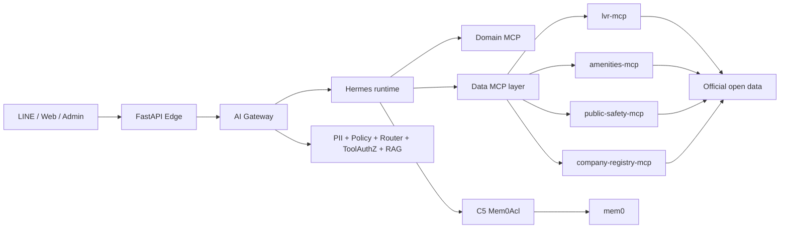

# AI Housekeeper Agent

[](https://github.com/trionnemesis/AIhouskeeperagent/actions/workflows/ci.yml)
[](https://www.python.org/)
[](https://nodejs.org/)
[](./TEST-REPORT.md)

> **AI Housekeeper Agent** 是一個有治理邊界的房仲 AI 第二大腦：結構化客戶記憶、物件工作流、台灣資料 MCP、LINE 互動入口，以及讓來源、租戶範圍與人工確認保持可見的政策邊界。

這個 repository 是房仲營運平台的工程底座，整合 **Hermes-Agent**、規劃中的 **mem0** 記憶邊界、Python／Node MCP services，以及 VM／GKE 部署路徑。它刻意採用 spec-driven 方式：清楚記錄應該建什麼、哪些已可執行、哪些已有驗證證據，以及哪些商業或 production gates 尚未通過。

這個專案的核心不是「在房產資料上加一層 LLM」。真正要累積的是結構化客戶記憶、配對與工作流嵌入。行情是有用的輸入，但延遲或格式錯誤的資料必須拒答，不能包裝成看似確定的建議。

[English README](./README.md) · [測試與部署報告](./TEST-REPORT.md) · [Spec Kit](./spec-kit/README.md) · [CI](https://github.com/trionnemesis/AIhouskeeperagent/actions)

## 目錄

- [為什麼做](#為什麼做)
- [不可妥協的底線](#不可妥協的底線)
- [怎麼運作](#怎麼運作)
- [目前有什麼](#目前有什麼)
- [信任與治理](#信任與治理)
- [安裝與驗證](#安裝與驗證)
- [本機 MCP workflow](#本機-mcp-workflow)
- [部署路徑](#部署路徑)
- [目前狀態](#目前狀態)
- [Repository 結構](#repository-結構)
- [研究與規格](#研究與規格)
- [常見問題](#常見問題)

## 為什麼做

房仲工作需要的不只是一個聊天介面：

- 物件說帖要一致而且可追溯；
- 客戶偏好要先結構化，才能安全進入記憶；
- 配對結果要說明依據與不確定性；
- 行情、交通、治安與公司資料要帶來源與 as-of metadata；
- 工作流要保留租戶範圍、同意、稽核與人工確認。

AI Housekeeper Agent 的目標，是建立一個能把這些活動接起來的治理層。Hermes 是 runtime foundation；MCP servers 提供受界定的 domain 與 data capabilities；Gateway 則是 policy、PII egress、routing、tool authorization 與 RAG behavior 的權威邊界。

商業 Gate A——至少五位房仲願意預付——目前尚未驗證。本 repository 是技術底座與驗證紀錄，不是 product-market fit 承諾。

## 不可妥協的底線

這些限制貫穿整個 repository：

1. **租戶隔離與 PII 是 P0 上線 blocker。** 所有租戶資料查詢都必須強制 WHERE tenant_id = ?。session_key 只能做會話路由，不是資料邊界；客戶記憶必須經由受治理的 C5/Mem0Acl 路徑。
2. **過期或格式錯誤的行情資料必須 fail closed。** 台灣實價資料可能延遲數月，也可能有錯誤日期；TimestampGuard、freshness metadata 與拒答比猜一個現在價格安全。
3. **Gateway 是政策權威。** PII masking、router rules、ToolAuthZ、RAG disclosure 與 591／leju denylist 不能只靠某個 agent 記住 prompt 規則。
4. **治安輸出維持粗粒度與中性。** 不做門牌級犯罪推論、不標記「安全／不安全區域」，也不把負面標籤套到單一物件。
5. **所有外部資料回答都要保留 provenance。** 輸出來源、資料截止／as-of date、信心，以及拒答或降級的原因。

## 怎麼運作

預期拓撲會把 runtime、資料取得與治理邊界分開：



實作分層原則：

- **Hermes-Agent** 維持 pinned runtime base；integration adapters 不改寫核心 runtime。
- **AI Gateway** 是不可繞過的 policy 與 egress boundary。
- **Data MCPs** 依資料源與故障域切分，不依任意功能名稱混在一起。
- **mem0** 是受治理的客戶記憶 sink，不是 data MCP 的直接依賴。
- **LINE** 是互動入口，不取代 tenant identity 或 authorization。

## 目前有什麼

| Layer | 目前實作 |
| --- | --- |
| packages/govnet | 官方資料 fetcher 的 TLS 驗證與有界 retry helpers。 |
| packages/datastore | SQLite／Postgres persistence、冪等寫入、provenance 與空間查詢防護。 |
| packages/mcp-lvr | 台灣實價資料 ingestion／query，包含民國日期解析、freshness checks、證據不足時拒答，以及以中文表頭動態定位成屋 33 欄／預售 31 欄雙 schema。 |
| packages/mcp-public-safety | 事故與犯罪聚合，包含 DI-5 粗粒度與座標感知輸出防護。 |
| shared/tw-utils | 統編、民國日期、郵遞區號、地址、捷運資料與 ETL transforms 等 deterministic 台灣工具。 |
| shared/scope-helper | 租戶 scope 注入與防止跨租戶覆寫。 |
| spec-kit | DDD、invariants、system contracts、BDD scenarios、data-MCP design 與 deployment roadmap。 |
| .mcp.json + scripts/lvr_query_via_mcp.py | 目前 feature branch 的本機 Claude Code MCP 接線與 LVR query helper。 |

目前資料層優先順序：

- **P0 lvr-mcp** — 實價登錄行情；
- **P1 amenities-mcp** — 交通、設施與 geocoding 設計；
- **P2 public-safety-mcp** — 事故、區域犯罪統計與防詐；
- **P2／partial company-registry-mcp** — 公司正規化與明確標註的資料源缺口。

## 信任與治理

| 邊界 | 規則 |
| --- | --- |
| **Identity** | Tenant 與 user scope 必須明確；session routing 不得被當作 authorization。 |
| **PII** | 未充分去識別的來源，在模型使用或寫入 memory 前，必須由 Gateway egress masking。 |
| **Tool authorization** | 591／leju 直接爬取預設 denylist；例外必須有法律與授權證據。 |
| **Freshness** | 行情、設施與治安輸出要有 as-of date 與 freshness decision。 |
| **Granularity** | 治安資料不得轉成 property-level negative label。 |
| **Auditability** | 資料寫入要保留 provenance；拒答原因與治理決策要可檢查。 |
| **Deployment** | Secret 必須放在 Secret Manager、Workload Identity 或核准的 runtime secret store，不能進 git。 |

接入真實客戶資料前，請先閱讀 [spec-kit/01-domain/invariants.md](./spec-kit/01-domain/invariants.md)、[spec-kit/05-data-mcp/invariants.md](./spec-kit/05-data-mcp/invariants.md) 與 [deploy/policy/policy.rego](./deploy/policy/policy.rego)。

## 安裝與驗證

需求：

- Python 3.13；
- Node.js 22；
- Docker，用於 Postgres 與 manifest gate；
- requirements.txt 中的 FastMCP 與 Postgres dependencies。

```bash
git clone https://github.com/trionnemesis/AIhouskeeperagent.git
cd AIhouskeeperagent

python3 -m venv .venv
.venv/bin/pip install -r requirements.txt
```

執行 Python package suites：

```bash
(cd packages/govnet && PYTHONPATH=. ../../.venv/bin/python -m unittest discover -s tests)
(cd packages/mcp-lvr && PYTHONPATH=.:../govnet ../../.venv/bin/python -m unittest discover -s tests)
(cd packages/mcp-public-safety && PYTHONPATH=.:../govnet ../../.venv/bin/python -m unittest discover -s tests)
(cd packages/datastore && PYTHONPATH=. ../../.venv/bin/python -m unittest discover -s tests)
```

執行 Node suites：

```bash
(cd shared/scope-helper && node --test)
(cd shared/tw-utils && node --test)
```

執行 deployment 與 policy verification：

```bash
.venv/bin/python scripts/deploy_smoke.py
bash deploy/verify.sh
```

[.github/workflows/ci.yml](./.github/workflows/ci.yml) 會重跑 Python、Node、Postgres、deploy-smoke 與 Kubernetes manifest gates。

## 本機 MCP workflow

目前的 feat/claude-code-mcp-local branch 加入本機 Claude Code wiring：

- hermes-lvr；
- hermes-public-safety；
- scripts/lvr_query_via_mcp.py。

在另一台機器使用 .mcp.json 前，請把 interpreter、repository 與 database 的絕對路徑改成該 checkout 的路徑。這是 local tool configuration，不是 portable production deployment manifest。

```bash
.venv/bin/python scripts/lvr_query_via_mcp.py 松山區 2026-06-21
```

這個 helper 只用於本機 workflow verification，不應繞過 Gateway PII、tenant、freshness 或 ToolAuthZ policy。

## 部署路徑

### MVP：單一 VM

VM 路徑是成本較低的 pilot：

- Docker Compose；
- Caddy 與 FastAPI Edge；
- 隔離的 data MCP services；
- Postgres datastore；
- Envoy egress controls；
- 初始 isolation shape 為一個 tenant 一台 VM。

請參考 [deploy/vm/](./deploy/vm/)、[deploy/vm/README.md](./deploy/vm/README.md) 與 [ADR-001](./spec-kit/06-platform-gke/adr-001-vm-for-mvp.md)。

### Scale path：GKE Autopilot

GKE 路徑是規模化設計：

- private Autopilot cluster；
- namespace-per-tenant；
- Cloud SQL 與 Memorystore；
- Envoy egress gateway；
- Terraform 加 Kustomize；
- manifest promotion 前的 policy checks。

請參考 [deploy/k8s/](./deploy/k8s/)、[deploy/terraform/](./deploy/terraform/) 與 [spec-kit/06-platform-gke/](./spec-kit/06-platform-gke/)。

Production 不會因為 manifests 能 render 就自動算「已完成」。真實 secret injection、租戶隔離、資料 durability、network policy、freshness monitoring 與 operational rollback 都需要 deployment-specific evidence。

## 目前狀態

這是具備 executable data MCP 與 deployment foundations 的**公開技術原型**。

| 範圍 | 狀態 |
| --- | --- |
| Core governance | Tenant scope、PII egress、freshness、provenance、ToolAuthZ 與治安粒度已規格化，並由 tests 或 policy gates 覆蓋。 |
| Data MCP | lvr-mcp 與 public-safety-mcp 已實作；amenities-mcp 與 company-registry-mcp 仍部分規格化或分階段。 |
| Verification baseline | TEST-REPORT.md 記錄 Python／Node tests、STDD×VDD mutation evidence、real-data E2E probes、GKE manifest validation 與 VM smoke evidence。 |
| Current branch | feat/claude-code-mcp-local 加入 .mcp.json 與 LVR MCP query helper。 |
| Commercial gate | Gate A——真實預付意願——仍未驗證。 |
| Production gaps | 真實 secret management、客戶／audit durable storage、LINE domain／TLS、freshness monitoring、正式 Hermes image 與多項 Gateway hardening 仍待完成。 |

狀態標籤遵循：

- **verified** — 有可重跑測試、policy gate 或已記錄的 E2E evidence；
- **inferred** — 由架構或實作推導，但尚未獨立執行；
- **unverified** — 需要外部 credentials、live deployment、商業證據或尚缺資料源。

## Repository 結構

| 路徑 | 用途 |
| --- | --- |
| [spec-kit/](./spec-kit/) | Product vision、glossary、DDD、contracts、BDD、data MCP 與 platform specs。 |
| [packages/govnet/](./packages/govnet/) | 官方資料安全網路與 retry helpers。 |
| [packages/datastore/](./packages/datastore/) | SQLite／Postgres persistence 與 provenance-aware queries。 |
| [packages/mcp-lvr/](./packages/mcp-lvr/) | 台灣實價登錄 MCP。 |
| [packages/mcp-public-safety/](./packages/mcp-public-safety/) | 具粗粒度防護的治安 MCP。 |
| [shared/tw-utils/](./shared/tw-utils/) | Deterministic 台灣工具與 ETL。 |
| [shared/scope-helper/](./shared/scope-helper/) | Tenant-scope helper。 |
| [deploy/vm/](./deploy/vm/) | MVP 單一 VM runtime。 |
| [deploy/k8s/](./deploy/k8s/) | Kubernetes base 與 overlays。 |
| [deploy/terraform/](./deploy/terraform/) | GKE、Cloud SQL、network、IAM 與 secret infrastructure。 |
| [deploy/policy/](./deploy/policy/) | OPA／conftest policy gates。 |
| [scripts/](./scripts/) | MCP entrypoints、ETL、query helpers 與 deployment smoke tests。 |
| [TEST-REPORT.md](./TEST-REPORT.md) | Test、E2E、deployment 與剩餘缺口證據。 |

## 研究與規格

- [spec-kit/00-overview/](./spec-kit/00-overview/) — product vision、glossary、north-star metric 與 Go/No-Go gates。
- [spec-kit/01-domain/](./spec-kit/01-domain/) — DDD context map、aggregates、events 與 invariants。
- [spec-kit/02-spec/](./spec-kit/02-spec/) — system architecture、data model、NFR、LINE、memory 與 tool contracts。
- [spec-kit/03-features/](./spec-kit/03-features/) — BDD scenarios 與 acceptance steps。
- [spec-kit/05-data-mcp/](./spec-kit/05-data-mcp/) — data-source decision matrix、MCP boundaries、compliance layer 與 open questions。
- [spec-kit/06-platform-gke/](./spec-kit/06-platform-gke/) — VM MVP 與 GKE scale path。
- [TEST-REPORT.md](./TEST-REPORT.md) — 驗證紀錄，不是 marketing claim。

## 常見問題

### 這是 production 房仲產品嗎？

還不是。它是具備 executable technical foundation 的 repository，並明確列出 business、data、governance 與 deployment gates。

### mem0 已經是客戶記憶的 source of truth 嗎？

架構把 mem0 放在 C5 Mem0Acl 後方。Repository 不接受 direct memory shortcut；真實客戶記憶 production path 仍需要獨立實作與驗收。

### 行情資料可以當成現在價格的 oracle 嗎？

不行。行情可能延遲，也可能有錯誤日期或 comparables 不足。系統應該呈現 freshness metadata、confidence 與 refusal state。

### Data MCP 可以爬任何房地產網站嗎？

不行。591／leju direct scraping 預設 denylist；只有具備明確授權與法律依據的資料源才可評估。

### 為什麼同時保留 VM 與 GKE？

單一 VM 是成本較低、容易操作的 MVP isolation shape；GKE 是在商業驗證、durable storage、secret handling 與 network policy 證據完成後的 scale path。

### 和 Hermes-Agent 的關係是什麼？

Hermes 是 pinned runtime base。本 repository 在外部增加 governed adapters 與 MCP services，不假設要重寫 Hermes core。
