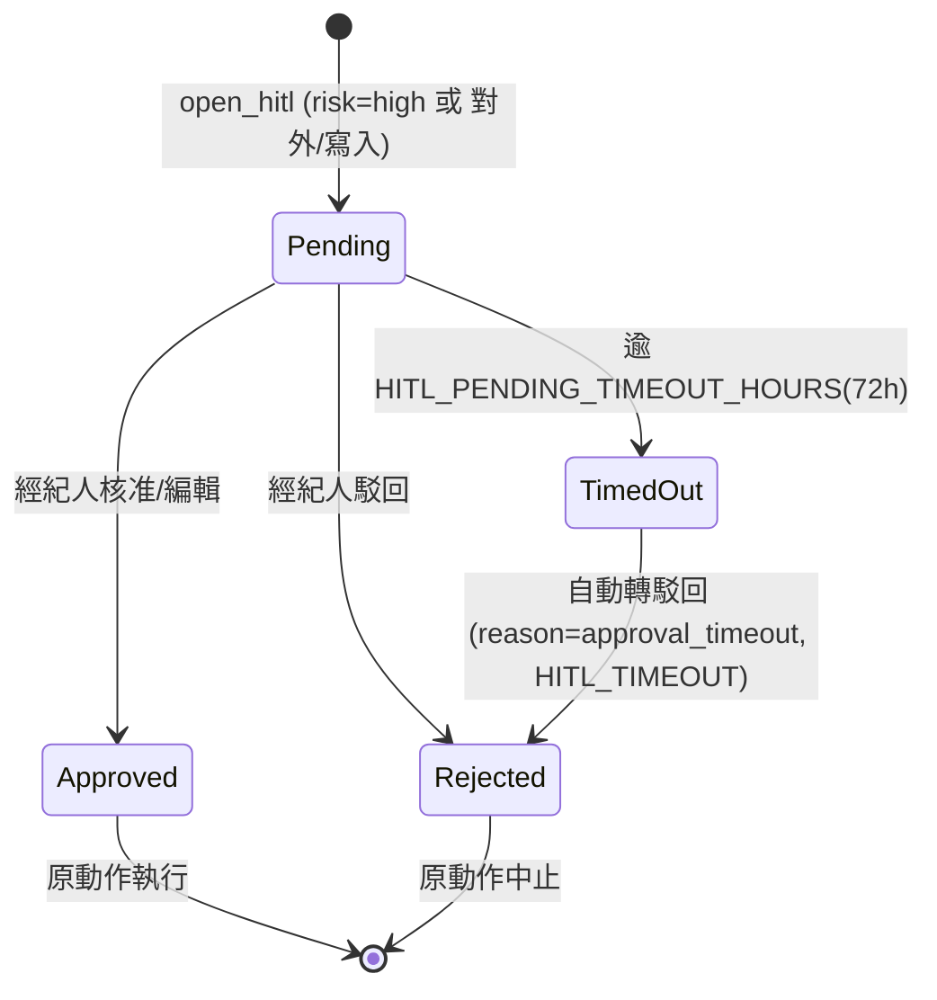
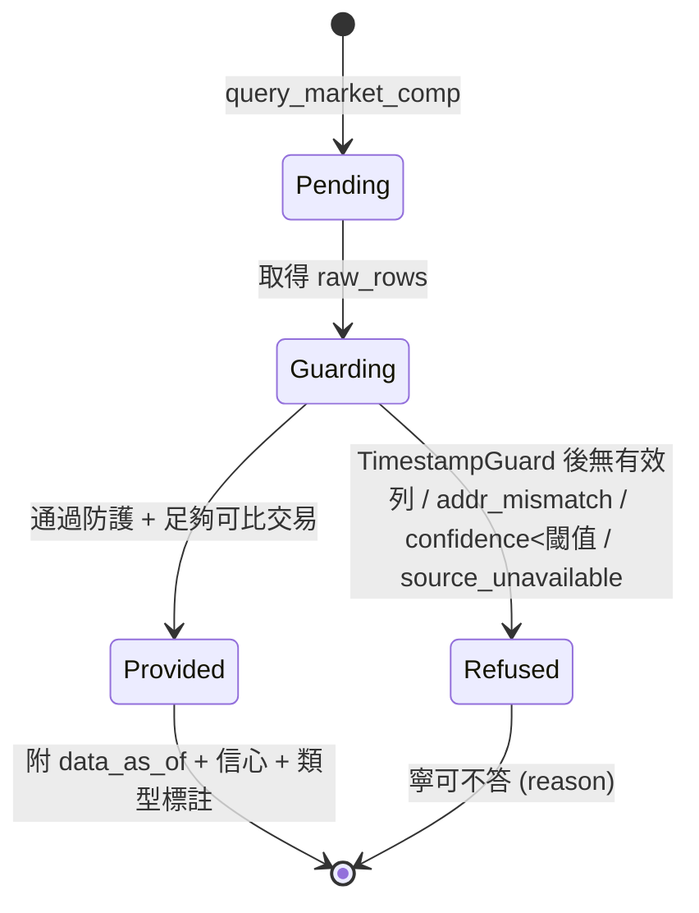
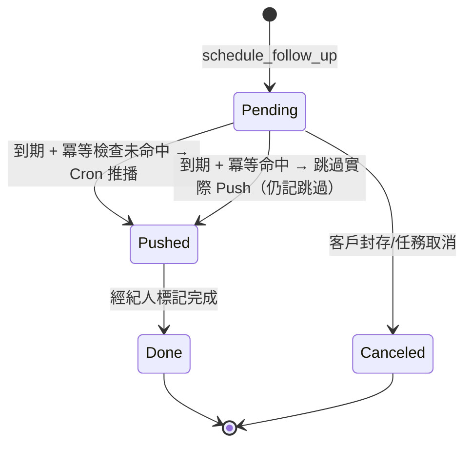
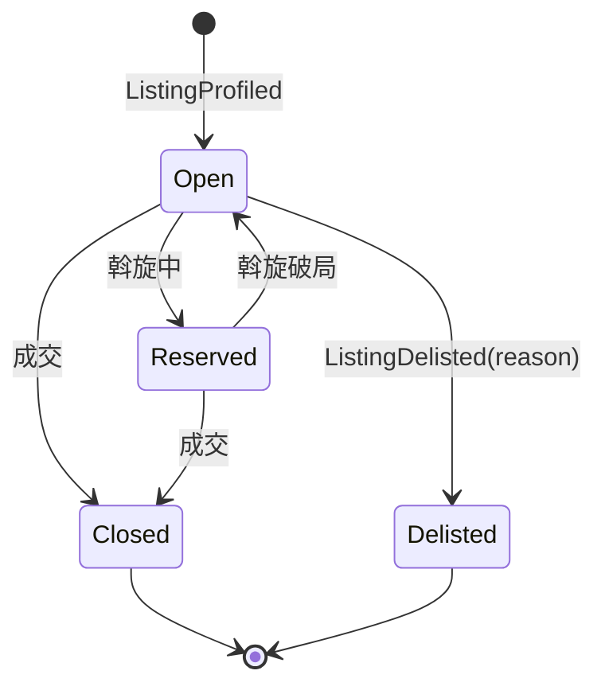
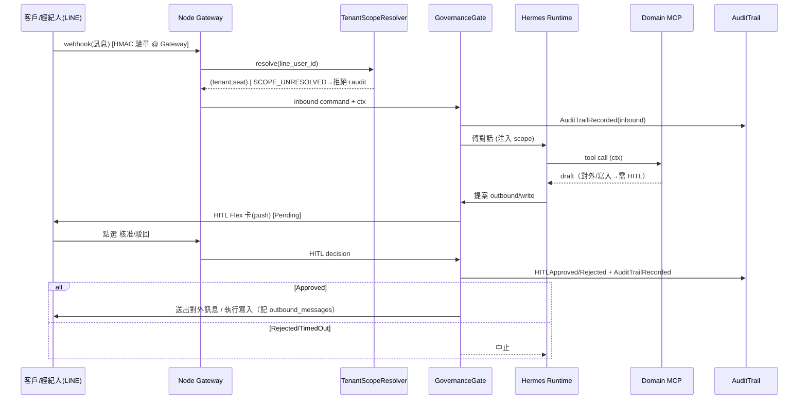

# 狀態機與端到端序列圖

> 補各 `status` 列舉缺乏轉移圖、逾時行為與跨 context 序列的缺口。Mermaid 可直接渲染。

## HITLApproval 狀態機（Inv-2）

- **終態**：`Approved`、`Rejected`（含 timeout 轉入）。
- **逾時**：Pending 超過 72h 自動 `TimedOut→Rejected`，避免動作懸置；發 `HITLRejected(reason=approval_timeout)`。
- 與 reply token（50s TTL）關係：HITL 屬**非同步**流程，不受 50s reply token 限制；逾 45s 走慢回應 Template Buttons（REL-3），HITL 卡本身用 push 發送。

## MarketCompQuery 狀態機（Inv-4/5/6）

- **終態**：`Provided`、`Refused`（皆唯讀結果，非錯誤）。

## FollowUpTask 狀態機（Inv-9）

## Listing 狀態機（見 [`../01-domain/domain-events.md`](../01-domain/domain-events.md) Listing Lifecycle）

## 端到端序列：LINE 訊息 → HITL → 對外（Inv-1/2/3）

> 逾時點標註：reply token 50s（同步回覆窗）、HITL Pending 72h（非同步核准窗）。
